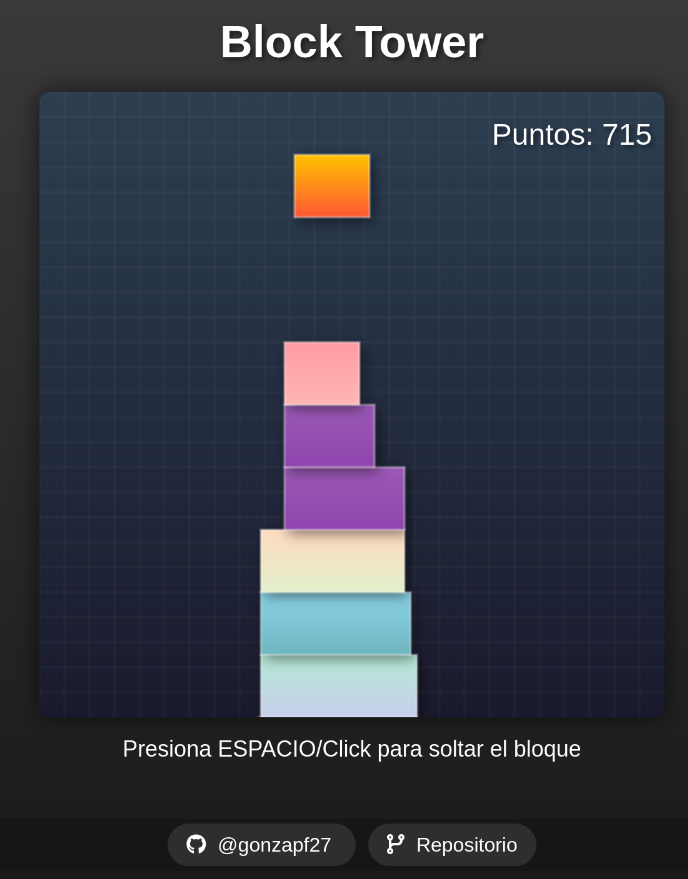

# 🎮 Block tower


Un juego adictivo y minimalista construido con JavaScript vanilla, donde el objetivo es apilar bloques con precisión para alcanzar la mayor puntuación posible.



## 🎯 Características

- 🎨 Diseño minimalista y atractivo
- 🌈 Paleta de colores dinámica
- ✨ Efectos de partículas
- 📱 Interfaz responsive
- 🎵 Efectos visuales suaves
- 🏆 Sistema de puntuación

## 🎮 Cómo Jugar

1. Los bloques se mueven automáticamente de lado a lado
2. Presiona ESPACIO o haz Click para soltar el bloque
3. Intenta alinear cada bloque con el anterior
4. ¡Cuanto más precisa sea la alineación, más puntos obtendrás!
5. El juego termina si un bloque no tiene contacto con el anterior

## 🛠️ Tecnologías Utilizadas

- HTML5 Canvas
- JavaScript Vanilla
- CSS3 (Efectos y animaciones)

## 🚀 Instalación y Uso

1. Clona este repositorio:

```bash
git clone https://github.com/gonzapf27/Block-Tower.git
```

2. Abre el archivo `index.html` en tu navegador web preferido
3. ¡Comienza a jugar!

## 🎨 Detalles Técnicos

- Implementación pura de JavaScript sin dependencias externas
- Uso de Canvas para renderizado de gráficos
- Sistema de partículas para efectos visuales
- Gradientes dinámicos para los bloques
- Detección de colisiones precisa

## 🤝 Contribuciones

Las contribuciones son bienvenidas. Para cambios importantes, por favor abre primero un issue para discutir qué te gustaría cambiar.

## 📝 Licencia

[MIT](LICENSE.md)

## 👤 Autor

<div align="center">
    
    <h3>Gonzalo Puga Fernández</h3>
    <a href="mailto:gonzalopg_mieres@hotmail.com">
        
    </a>
    <a href="https://github.com/gonzapf27/">
        
    </a>
</div>

---

⭐️ ¡Si te gusta este proyecto, no dudes en darle una estrella en GitHub! ⭐️ [](https://github.com/gonzapf27/Block-Tower/stargazers)
